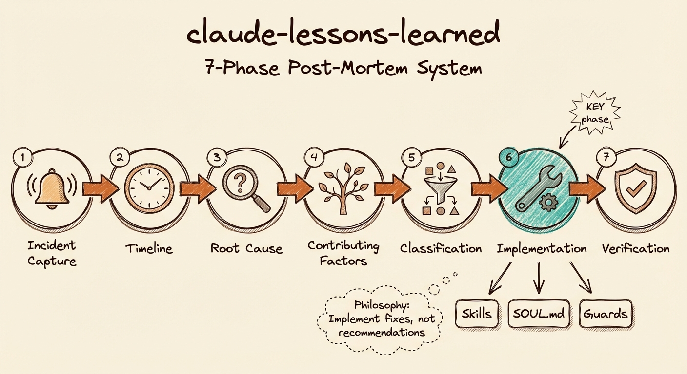

# Claude Lessons Learned

[](https://opensource.org/licenses/MIT)
[](https://claude.ai)

A Claude Code skill for structured retrospective analysis that transforms incidents into systematic improvements.



## Demo Video

[](https://www.youtube.com/watch?v=ps-w7cBz9Ew)

Watch the skill run a live post-mortem on social media integration issues - tracing root causes, identifying fixes, and implementing them directly.

## The Problem

When things go wrong, the typical response is:

- Quick fixes that don't address root causes
- "Be more careful next time" (which doesn't work)
- Lessons that get forgotten
- Same mistakes repeated

This skill provides a structured framework for turning problems into durable improvements.

## How It Works

The skill guides you through a 7-phase retrospective process:

| Phase | Focus | Output |
|-------|-------|--------|
| 1. Definition | What happened? | Incident summary |
| 2. Timeline | Sequence of events | Chronological table |
| 3. Root Cause | 5 Whys analysis | Fundamental issue |
| 4. Factors | What contributed? | Factor matrix |
| 5. Classification | What type of fix? | Fix type decision |
| 6. Implementation | Encode the fix | Actual changes made |
| 7. Verification | How to test? | Success criteria |

## Key Principle: Implement, Don't Recommend

The skill enforces a critical rule: **don't just recommend fixes - implement them**.

This means:
- Creating or updating skills with new guards
- Adding documentation to prevent knowledge gaps
- Building automation for forgotten manual steps
- Encoding checklists for multi-step verification

## Installation

### Option 1: Copy to your Claude Code skills directory

```bash
# Clone the repository
git clone https://github.com/aplaceforallmystuff/claude-lessons-learned.git

# Copy to your Claude Code skills directory
cp -r claude-lessons-learned/skills/lessons-learned ~/.claude/skills/
```

### Option 2: Clone directly to skills directory

```bash
git clone https://github.com/aplaceforallmystuff/claude-lessons-learned.git ~/.claude/skills/lessons-learned
```

### Option 3: Manual installation

1. Create the directory: `mkdir -p ~/.claude/skills/lessons-learned`
2. Download [SKILL.md](skills/lessons-learned/SKILL.md) to that directory

## Usage

The skill activates when you say:

- "lessons learned"
- "what went wrong"
- "post-mortem"
- "retrospective"
- "how do we prevent this"
- "that shouldn't have happened"

### Example Output

```markdown
# Lessons Learned: Premature GitHub Push

**Date:** 2025-01-04
**Severity:** Medium
**Status:** Resolved

## Incident Summary

Pushed code to public GitHub repo before sanitizing personal references.

## Timeline

| Time | Action | Actor | Outcome |
|------|--------|-------|---------|
| 14:32 | Created skill file | Claude | Success |
| 14:35 | Committed changes | Claude | Success |
| 14:36 | Pushed to GitHub | Claude | Personal path exposed |
| 14:38 | User noticed issue | User | Alerted |
| 14:42 | Reverted and re-pushed | Claude | Resolved |

## Root Cause

Missing sanitization step in publishing workflow.

## Fixes Implemented

| Fix | Type | Location | Status |
|-----|------|----------|--------|
| Add sanitization guard | Skill | ~/.claude/skills/publish-guard/ | Created |
| Update prep-repo to require sanitization | Doc | CLAUDE.md | Updated |

## Lessons

1. Always run sanitization check before any public push
2. Encode mandatory steps as guards, not reminders
```

## Common Incident Patterns

| Pattern | Symptom | Typical Fix |
|---------|---------|-------------|
| **Premature Action** | Action before approval | Add explicit approval gate |
| **Sequence Error** | Wrong step order | Encode dependency chain |
| **Missing Validation** | Bad data passed through | Add validation checkpoint |
| **Context Carryover** | Prior session assumptions | Verify context at start |
| **Scope Creep** | Did more than requested | Ask before expanding |

## Fix Types

| Type | When to Use | Example |
|------|-------------|---------|
| **Skill** | Recurring workflow needs structure | Create new SKILL.md |
| **Guard** | Action requires checkpoint | Add approval gate |
| **Documentation** | Knowledge gap | Update CLAUDE.md |
| **Automation** | Manual step forgotten | Create hook/script |
| **Checklist** | Multiple steps need verification | Add to skill |

## Anti-Patterns to Avoid

| Don't | Why | Instead |
|-------|-----|---------|
| Assign blame | Creates defensiveness | Focus on process |
| Single-cause thinking | Oversimplifies | Use 5 Whys |
| Just recommend | Lessons forgotten | Implement during retrospective |
| Vague fixes | "Be careful" doesn't work | Encode specific changes |
| Skip verification | No way to know if fixed | Define success criteria |

## License

MIT License - see [LICENSE](LICENSE)

---

**The goal: Every mistake makes the system stronger, not just the memory longer.**
